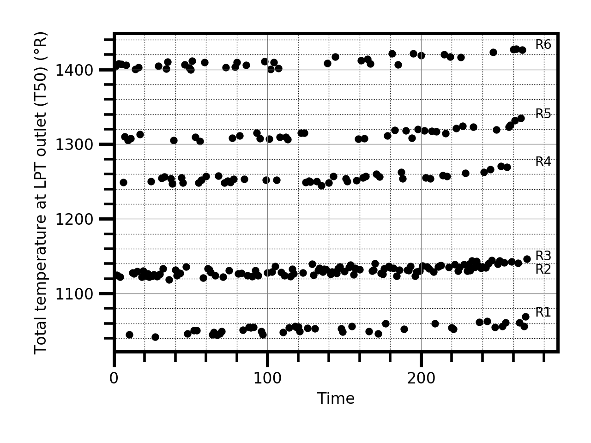
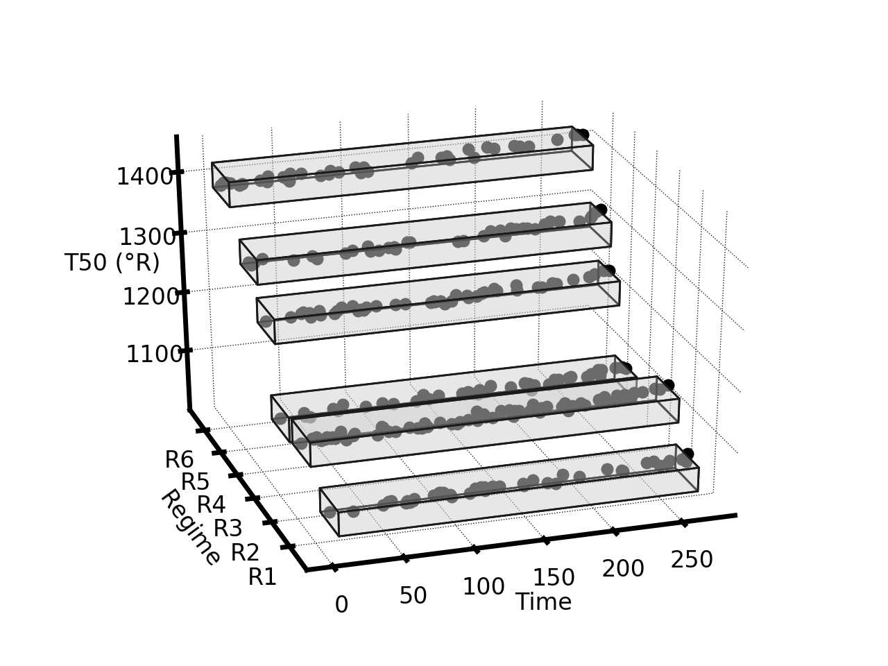
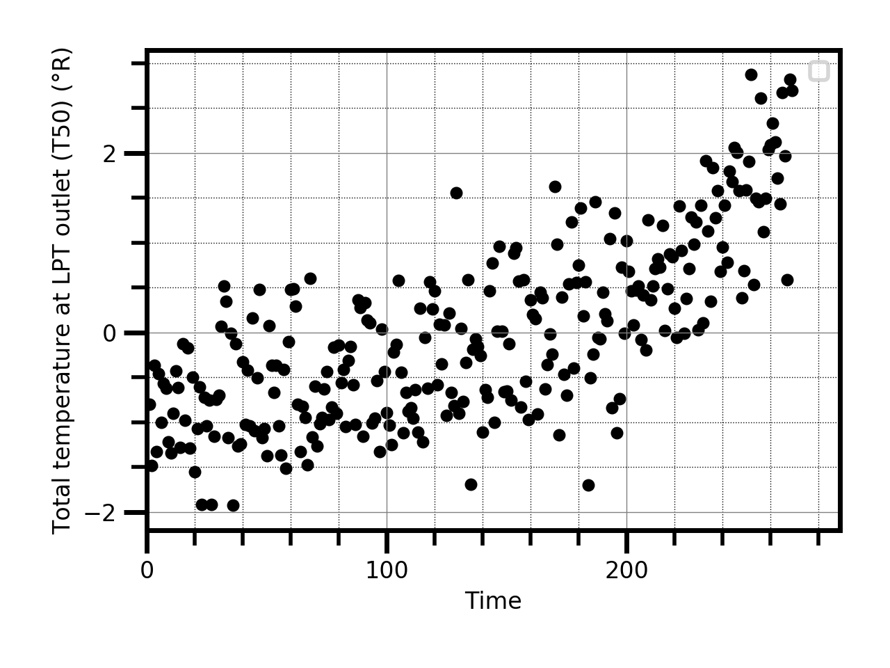

# Operating Regime Normalization

Changing operational and environmental conditions pose significant challenges in many engineering tasks, including prognostics. In the presence of dynamic operating regimes, degradation can have distinct data profiles depending on the operational and environmental conditions. When these conditions are not factored out, it can be difficult to observe the deterioration path of the equipment. Therefore, it is useful to "baseline" the  data to focus on changes of system health. By baselining, we mean to eliminate the extra dimension of the data introduced by the dynamic conditions.

<p float="center">
  
  
  
</p>

This repository provides code to normalize the data within each operating regime using a Multi-Layer Perceptron (MLP) network. The method works in an unsupervised way.   

The basic usage is:

```
mean_unit_error, normalized_sensor = normalize_data(dataset_id=2, sensor_name="phi", learning_rate=10e-9, min_val=-0.01, max_val=0, epochs=10, batch_size=32, visualize_normalization=True)
```

The `dataset_id` parameter indicates the dataset (2 or 4) of the C-MAPSS repository that you want to use. The parameter `sensor_name` defines the sensor to be normalized. 
The remaining constitute the network hyper-parameters. 

The function `normalize_data` returns the mean absolute error in relation to the standard rule `mean_unit_error and the normalized sensor `normalized_sensor`

## C-MAPSS

The Commercial Modular Aero-Propulsion System Simulation (C-MAPSS) was developed at the NASA Glenn Research Center. The simulator emulates a large, high-bypass ratio turbofan engine similar to the GE90. The model is composed of several modules, as shown below. Six different flight conditions were simulated based on three operational conditions: altitude (0-42K ft.), Mach number (0-0.84), and throttle resolver angle (20-100). The throttle resolver angle, or TRA, is the angular deflection of the pilot’s power lever, varying between 0 and 100%. The Mach number is the ratio of flow velocity to the speed of sound at the medium. Altitude relates to atmospheric conditions.

 

The C-MAPSS data consists in a collection of time series of observables at cruise snapshots produced due to variation of the flow and efficiencies of the High Pressure Compressor (HPC) module from initial settings (nominal behavior) to failure values. Each degradation trajectory is characterized by series of observables (features) that include sensor and operational variables, that change over time from some nominal condition to failure. 

## Multi-Layer Perceptron

The Multi-Layer Perceptron (MLP) or Feed Forward Neural Network (FFNN) is the classical neural network model. The MLP can be composed of one or more layers, whose neurons are fully connected. The MLP is fully connected in the sense that each neuron in a layer is connected to all the neurons in the previous layer. Despite this forward dependence between successive layers, neurons (and its weights) are independent in the same layer. 
There are several cases, such as our own, where the goal of the neural network is not to approximate a function but to optimize network properties. For example, variational autoencoders can learn data distributions in an unsupervised fashion by optimizing a Gaussian prior that is solely a function of the hidden layers. Sparse autoencoders are also based on the principle of unsupervised machine learning \cite{bengio2009learning}; they work by placing a sparsity constraint on the activations of the hidden layers. In our case, we place a restriction on the output signal. This allows us to baseline the input signal without having to supervise the network. \added{The novelty of our proposed ``normalizing'' MLP is the underlying idea that we optimize the network using an error function that does not depend on the difference between network input and output but only on the output. We believe this is an idea of significance both to prognostics and machine learning in general. 

<p float="center">
  
</p>

## Libraries Used

Python

- [Python Standard Library](https://docs.python.org/2/library/): Built in python modules.
- [Numpy](https://numpy.org/): Scientific computing with python.
- [Pandas](https://pandas.pydata.org/): Data analysis tools.
- [Scikit-learn](https://scikit-learn.org/stable/): Machine learning toolkit.
- [Matplotlib](https://matplotlib.org/): Library for creating static, animated, and interactive visualizations in Python. 
- [Keras](https://keras.io/): Python deep learning API.  

### Note

The code was developed for C-MAPSS datasets but it can be easily adapted to other applications. 

### Support or Contact

Having trouble with this repository? Contact me and we’ll help you sort it out.

